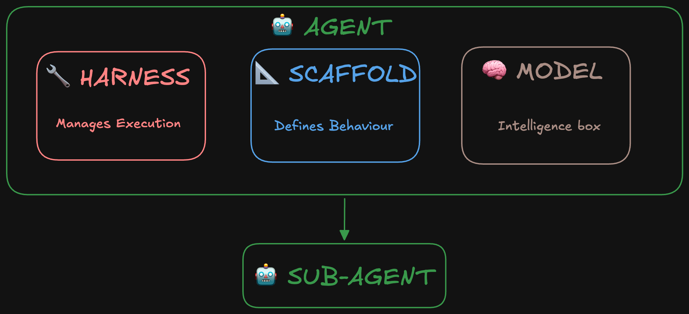

::: {.callout-warning}
## Draft — Not Yet Reviewed

This appendix is a work in progress. Content below is subject to revision.
:::

Large language models (LLMs) are the engine behind today's AI tools, and agents are what let those models act in the world rather than just talk about it. This appendix builds a working intuition for both — starting from a simple letter-guessing game and building up to the same loop that powers modern AI agents.

::: {.callout-note}
## Learning Outcomes

By the end of this appendix you will be able to:

- Explain, at an intuitive level, how an LLM predicts its next word — and why that one simple mechanism is behind everything from an essay to working code
- Describe how "temperature" controls the balance between predictable and varied generated text, and when you'd want each
- Read a letter-pair probability heatmap as a small-scale example of the same statistical prediction an LLM performs at word scale
- Distinguish the model (the word generator), the harness (what lets it take actions), and the scaffolding (what shapes its behavior)
- Describe the agent loop — think, call a tool, observe, repeat — and explain why it needs a context window
- Use the core vocabulary of AI agents: model, scaffolding, harness, sub-agent

:::

## What Does a Large Language Model Actually Do?

Strip away the chat interface, the personality, and the impressive-sounding answers, and a large language model is doing one very specific thing: predicting the next word. Given all the text it has seen so far — your prompt, plus whatever it has already generated in its own reply — it estimates how likely every possible next word is, and picks one (usually, but not always, the most likely one). Then it treats that new word as part of the text, and repeats the exact same process to pick the *next* word. An entire essay, a working piece of code, or something that reads like step-by-step reasoning is all produced this same way: one word — technically, one *token* — at a time, in a loop, with nothing more exotic underneath it than "what comes next, statistically speaking?"

A much smaller version of the same idea is something you already do without thinking about it: guessing the next **letter**. If someone tells you a word starts with "q" and asks you to guess the next letter, almost everyone immediately says "u." Nobody taught you this as a formal rule — you absorbed it as a statistical regularity from years of reading English. The same intuition extends further: after "th," you'd bet heavily on a vowel; after "qu," almost any vowel is plausible; after "tz," you'd be genuinely unsure. An LLM is built on exactly this kind of pattern, just learned automatically from enormous amounts of text rather than picked up unconsciously over a lifetime of reading — and applied to whole words (technically *tokens*) instead of single letters.

You can see this letter-level pattern directly. The heatmap below plots how often each pair of letters actually occurs in typical English text:

{fig-alt="26x26 heatmap grid of English letter-pair probabilities, rows and columns labeled a to z, with the q column almost empty except at row u"}

A few things are worth noticing in this grid, beyond the obvious "q is always followed by u":

- Some rows are almost entirely dark — common letters like "e," "t," and "s" combine freely with many others
- Some columns are nearly empty — "q" is the clearest example, but a few other letters are similarly restrictive about what can precede them
- The pattern is not symmetric: how likely "h" is to follow "t" (as in "the," "that," "this") is very different from how likely "t" is to follow "h"

This 26×26 grid is a complete, human-readable table of every letter-pair probability in English. A real LLM does the same kind of thing, just at a scale that can no longer be drawn as a picture: its "vocabulary" is tens of thousands of tokens rather than 26 letters, and the probability of "what comes next" depends not just on the previous token but on everything in the model's entire context — the whole conversation so far. That table isn't hand-built the way this heatmap could be; it's learned automatically, by training the model to get better and better at next-token prediction across a vast amount of text.

## Temperature: How Predictable Should the Output Be?

At every single step, an LLM doesn't just compute one "correct" next word — it computes a full probability distribution over its entire vocabulary: a ranked list of every possible next token, each with a likelihood attached. *How* you choose from that distribution is a separate decision from the model's prediction itself, and it's controlled by a parameter called **temperature**.

At **temperature 0**, the model always takes the single most likely next word, every time. This is fully deterministic — the same prompt always produces the same output — but it tends to get repetitive quickly, since the model keeps steering back toward its own most well-worn phrasing. Prompted with "The best thing about AI is its ability to…", a temperature-0 model produces something like this:

> The best thing about AI is its ability to learn from experience. It's not just a matter of learning from experience, it's learning from the world around you. The AI is a very good example of this. It's a very good example of how to use AI to improve your life. It's a very good example of how to use AI to improve your life. […]

Notice how it starts looping — "a very good example of" appears three times in a handful of sentences. Once the model commits to a phrase, temperature 0 gives it no way to escape that phrase's gravity.

At **temperature 0.8**, the model sometimes picks a "non-top" word instead, chosen at random but weighted by probability — likely words are still likely to get picked, just no longer guaranteed. Building up the same prompt word by word looks like this:

> The best thing about AI is its ability to,
> The best thing about AI is its ability to create,
> The best thing about AI is its ability to create worlds,
> The best thing about AI is its ability to create worlds that,
> The best thing about AI is its ability to create worlds that are,
> The best thing about AI is its ability to create worlds that are both,
> The best thing about AI is its ability to create worlds that are both exciting,

Each step still picks a plausible next word, but "create" was not the single most likely candidate the way temperature 0 would have chosen — it was one of several reasonable options, selected by weighted chance. Because the choice really is random, running the exact same prompt again at temperature 0.8 gives a different answer every time:

- "…its ability to learn. I've always liked the"
- "…its ability to really come into your world and just"
- "…its ability to examine human behavior and the way it"
- "…its ability to do a great job of teaching us"
- "…its ability to create real tasks, but you can"

This gives you a practical dial, not just a curiosity. Low temperature suits tasks where there's essentially one right answer and you want reliable, reproducible output — data extraction, classification, boilerplate code. Higher temperature suits tasks where variety is the point — brainstorming, early drafts, creative writing — at a direct cost in predictability and, past a certain point, coherence. The trade-off is symmetric: **temperature 0 is safe but dull and repetitive; higher temperature is varied and more "creative," but progressively less reliable and harder to reproduce.** That unreliability is exactly why [Chapter 1 warns against trusting unverified GenAI output for anything beyond brainstorming](ch01-chapter-one.qmd#avoiding-research-misconduct) — a model sampling at temperature 0.8 is, by design, capable of confidently generating something it did not generate the previous time you asked.

## From Word Generators to Agents

Everything so far describes a model that predicts text — it has no way to *do* anything with the outside world on its own. An **AI agent** closes that gap by pairing the model with additional machinery that lets it take real actions. Following the vocabulary from Hugging Face's agent glossary, that machinery splits into two parts:

- The **model** — the "intelligence box." This is the LLM itself (whichever version of Sonnet, Opus, or Fable you select when using Claude, for example) — the word generator described above, and nothing more
- The **harness** — the "body." This is all of the surrounding code that lets the word generator take actions: it calls the model, executes whatever the model asks for, and decides when the task is finished
- Sitting between them is the **scaffolding** — the layer that shapes the model's behavior: system prompts, tool descriptions, and the rules for how context gets assembled and formatted before it ever reaches the model

Put together, here is how a single step of the loop actually plays out. Suppose an agent has been asked to find three recent papers on a topic. The model reasons about what to do next and, when it decides it needs information it doesn't have, it doesn't fetch that information itself — it outputs a **tool call**: structured text that essentially says "run a search for X." The harness is what actually executes that call — running the search, hitting an API, or whatever the tool requires — and then feeds the result back into the model's context, as if it had just been handed a new piece of the conversation. The model reads that result, reasons about what it means, and decides what to do next: call another tool, refine the search, or write up a final answer. This is the loop — **think, act, observe, repeat** — and it continues until the model decides the task is done.

Two things make this loop workable rather than something that runs forever or grinds to a halt:

- **The context window.** An LLM has a hard limit on how much text it can consider at once — its working memory, measured in tokens. The chat history, any files, and every tool output all count against this limit, much like a person's short-term memory filling up over a long conversation. Once the context window starts to fill, the harness has to intervene: it intelligently compresses older parts of the conversation, typically by summarizing them, so the agent can keep working without simply forgetting where it started
- **Sub-agents.** For larger tasks, the harness can delegate pieces of the work to other agent instances entirely — **sub-agents** — sometimes running several of them in parallel, each with its own context window and its own task, reporting their results back to the agent that spawned them. This is the same trick a human team lead uses when a single person's attention would otherwise become the bottleneck

{fig-alt="Diagram showing an Agent box containing Harness, Scaffold, and Model boxes, with an arrow down to a Sub-Agent box"}

The short version: an LLM on its own is a very capable autocomplete, with no memory beyond its context window and no way to affect anything outside the conversation. An agent is what you get once that autocomplete is wrapped in a harness that lets it call tools, watches its context window, and — when the task is big enough — delegates. For the more precise, evolving vocabulary around agents — model vs. scaffolding vs. harness vs. sub-agent — see the Hugging Face agent glossary in the references below.

::: {.callout-note}
## Takeaways

- An LLM is fundamentally a next-word (next-token) predictor, trained on statistical patterns across huge amounts of text — the letter-pair heatmap is the same idea at a scale small enough to draw
- Temperature controls the trade-off between predictable-but-repetitive output (temperature 0) and varied-but-less-reliable output (higher temperatures) — pick low for tasks with one right answer, higher for brainstorming and variety
- An agent is a model plus a harness plus scaffolding: the model decides what to do, the scaffolding shapes how it decides, and the harness lets it actually act
- The think → act → observe loop, plus active context-window management and, for larger tasks, sub-agents, is what turns a word generator into something that can complete multi-step work on its own
:::

## References

1. Wolfram, S. (2023). *What Is ChatGPT Doing … and Why Does It Work?*. [writings.stephenwolfram.com](https://writings.stephenwolfram.com/2023/02/what-is-chatgpt-doing-and-why-does-it-work/)
2. Aalto Data Agents. (n.d.). *Chapter 0: Introduction*. [aaltodataagents.github.io](https://aaltodataagents.github.io/gen-ai-and-research-work/ch00-intro.html)
3. Hugging Face. (2025). *The AI Agents Glossary*. [huggingface.co](https://huggingface.co/blog/agent-glossary)
